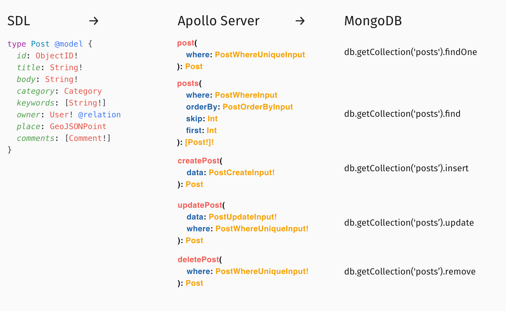

# apollo-model-mongodb BETA



## Description

This package allows you to automatically generate Apollo Server schema and resolvers for MongoDB using Prisma-like SDL.

We like Prisma but we want to build a more flexible and customizable solution.

[](https://spectrum.chat/apollomodelmongo)

## Quick preview on codesandbox

Note!
The database connected with read-only permissions. So mutation will not work. You can create and connect your own database (for example use [Atlas](http://atlas.mongodb.com))

[](https://codesandbox.io/s/github/vitramir/apollo-model-mongodb/tree/master/examples/example-server)

## Installation

With yarn:

```
  yarn add apollo-model-mongodb

```

or using npm:

```
  npm install --save apollo-model-mongodb
```

## Usage

Project initialization is the same as for [Apollo Server](https://www.apollographql.com/docs/apollo-server/getting-started.html). The only difference is that we use `makeExecutableSchema` from this package to generate schema.

```javascript
import ApolloModelMongo, { QueryExecutor } from 'apollo-model-mongodb';
const schema = await new ApolloModelMongo({
  queryExecutor: QueryExecutor(db),
}).makeExecutablSchema({
  typeDefs,
});

const server = new ApolloServer({
  schema,
});
```

You can find full examples [here](examples)

## SDL example

```graphql
type Category @model {
  id: ObjectID! @id @unique @db(name: "_id")
  title: String
  parentCategory: Category @relation(storeField: "parentCategoryId")
  subcategories: [Category!] @extRelation(storeField: "parentCategoryId")
  posts: [Post!] @extRelation
}

type Comment {
  body: String
  user: User! @relation
}

type Post @model {
  id: ObjectID! @id @unique @db(name: "_id")
  title: String!
  body: String!
  category: Category @relation
  keywords: [String!]
  owner: User! @relation
  place: GeoJSONPoint
  comments: [Comment!]
}

interface User @inherit @model {
  id: ObjectID! @id @unique @db(name: "_id")
  username: String! @unique
}

enum AdminRole {
  superadmin
  moderator
}

type Admin implements User {
  role: AdminRole
}

enum SubscriberRole {
  free
  standard
  premium
}

type SubscriberProfile {
  firstName: String!
  lastName: String!
}

type Subscriber implements User {
  role: SubscriberRole
  profile: SubscriberProfile!
}
```

(**Temporary the below link contains old build**. Use [codesanbox](#quick-preview-on-codesandbox) to preview result until we solve [this issue](https://github.com/zeit/now-builders/issues/171))

The above SDL generates this endpoint [https://apollo-model-mongodb-example.now.sh](https://apollo-model-mongodb-example.now.sh)

Example queries [below](#features)

## Directives

### The `model` directive

- Connects object with MongoDB collection.
- Valid locations: OBJECT or INTERFACE
- Optional
- Arguments
  _ collection:String
  _ The name of MongoDB collection \* Optional (Default value is pluralized name of the object)

### The `unique` directive

- Add field to WHERE_UNIQUE input type
- Valid locations: FIELD
- Optional

### The `id` directive

- Mark field as identifier. Skip creation.
- Valid locations: FIELD
- Optional

### The `db` directive

- Map GraphQL field to collection.
- Valid locations: FIELD
- Optional
- Arguments
  _ name:String
  _ The name of field in collection \* Required

### The `inherit` directive

- Clones interface fields to objects.
- Valid locations: INTERFACE
- Required

### The `discriminator` directive

- Used to define field and values to resolve implementation type.
- Valid locations: INTERFACE or OBJECT
- Optional
- Arguments
  _ value:String
  _ Required

### The `relation` directive

- Used to define relation between two collections.
- Valid locations: FIELD
- Optional
- Arguments
  _ field:String
  _ Optional
  _ Default value: \_id
  _ storeField:String
  _ Optional
  _ Default value: `${TypeName}Id${s}`

### The `extRelation` directive

- Used to define external relation between two collections (identifiers stored in related documents).
- Valid locations: FIELD
- Optional
- Arguments
  _ field:String
  _ Optional
  _ Default value: \_id
  _ storeField:String
  _ Optional
  _ Default value: `${TypeName}Id${s}`
  _ many:Boolean
  _ Optional \* Default value: false

## Serverless

You can use this package with serverless environments. Read more [here](https://www.apollographql.com/docs/apollo-server/servers/lambda.html). Also take a look at [example-now](examples/example-now) if you are using Zeit Now.

## Customization

- You can define your own scalars and directives as for usual Apollo server.
- You can add custom modules at MongoModel stage (docs coming soon)
- All queries to DB executes with QueryExecutor function. This package has predefined one, but you can override it and add hooks or check user authorization.

```
const QueryExecutor = ({ type, collection, doc, docs, selector, options })=>Promise
```

## Contribution

You are welcome to open Issues, Feature Requests and PR with new features and bug fixes

## Roadmap

- Add createdAt, updatedAt directives
- Filter by Nth array element
- Add subscriptions
- Release stable version 1.0.0
- Add Moment scalar
- Improve Geo queries support

## Features

- [Simple query](#simple-query)
- [Simple create](#simple-create)
- [Filter](#filter)
- [Difficult filter](#difficult-filter)
- [Relation query](#relation-query)
- [Relation filter](#relation-filter)
- [Relation create](#relation-create)
- [Nested create](#nested-create)
- [Interfaces](#interfaces)
- [Geo queries](#geo-queries)

### Simple query

##### query

```graphql
{
  categories {
    id
    title
  }
}
```

##### response

```json
{
  "data": {
    "categories": [
      {
        "id": "5c3f4d84e98bd4e76e1d34d1",
        "title": "root"
      },
      {
        "id": "5c3f4dd3e98bd4e76e1d34d2",
        "title": "JS"
      },
      {
        "id": "5c3f4f46e98bd4e76e1d34d3",
        "title": "MongoDB"
      }
    ]
  }
}
```

### Simple create

##### query

```graphql
mutation {
  createCategory(data: { title: "root" }) {
    id
  }
}
```

##### response

```json
{
  "data": {
    "createCategory": {
      "id": "5c3f4d84e98bd4e76e1d34d1"
    }
  }
}
```

### Filter

##### request

```graphql
{
  categories(where: { title: "root" }) {
    id
    title
  }
}
```

#### response

```json
{
  "data": {
    "categories": [
      {
        "id": "5c3f4d84e98bd4e76e1d34d1",
        "title": "root"
      }
    ]
  }
}
```

### Difficult filter

##### request

```graphql
{
  categories(where: { OR: [{ title: "root" }, { title: "JS" }] }) {
    id
    title
  }
}
```

#### response

```json
{
  "data": {
    "categories": [
      {
        "id": "5c3f4d84e98bd4e76e1d34d1",
        "title": "root"
      },
      {
        "id": "5c3f4dd3e98bd4e76e1d34d2",
        "title": "JS"
      }
    ]
  }
}
```

### Relation query

##### query

```graphql
{
  categories {
    id
    title
    parentCategory {
      title
    }
  }
}
```

##### response

```json
{
  "data": {
    "categories": [
      {
        "id": "5c3f4d84e98bd4e76e1d34d1",
        "title": "root",
        "parentCategory": null
      },
      {
        "id": "5c3f4dd3e98bd4e76e1d34d2",
        "title": "JS",
        "parentCategory": {
          "title": "root"
        }
      },
      {
        "id": "5c3f4f46e98bd4e76e1d34d3",
        "title": "MongoDB",
        "parentCategory": {
          "title": "root"
        }
      }
    ]
  }
}
```

### Relation filter

##### query

```graphql
{
  categories(where: { parentCategory: { title: "root" } }) {
    id
    title
  }
}
```

##### response

```json
{
  "data": {
    "categories": [
      {
        "id": "5c3f4dd3e98bd4e76e1d34d2",
        "title": "JS"
      },
      {
        "id": "5c3f4f46e98bd4e76e1d34d3",
        "title": "MongoDB"
      }
    ]
  }
}
```

### Relation create

##### query

```graphql
mutation {
  createCategory(
    data: {
      title: "Mongodb"
      parentCategory: { connect: { id: "5c3f4d84e98bd4e76e1d34d1" } }
    }
  ) {
    id
  }
}
```

##### response

```json
{
  "data": {
    "createCategory": {
      "id": "5c3f4f46e98bd4e76e1d34d3"
    }
  }
}
```

### Nested create

##### query

```graphql
mutation {
  createSubscriber(
    data: {
      username: "subscriber1"
      profile: { create: { firstName: "Gwion", lastName: "Britt" } }
    }
  ) {
    id
    username
  }
}
```

##### response

```json
{
  "data": {
    "createSubscriber": {
      "id": "5c3f555b190d25e7bda1dea2",
      "username": "subscriber1"
    }
  }
}
```

### Interfaces

#### Connect

##### query

```graphql
mutation {
  createPost(
    data: {
      title: "Build GraphQL API with Apollo"
      body: "Lorem ipsum dolor sit amet, consectetur adipiscing elit."
      owner: { connect: { Admin: { username: "admin" } } }
    }
  ) {
    id
  }
}
```

##### response

```json
{
  "data": {
    "createPost": {
      "id": "5c401347de7e67e9540abad2"
    }
  }
}
```

#### Query

##### query

```graphql
{
  posts {
    title
    owner {
      username
      ... on Subscriber {
        profile {
          firstName
          lastName
        }
      }
    }
  }
}
```

##### response

```json
{
  "data": {
    "posts": [
      {
        "title": "Build GraphQL API with Apollo",
        "owner": {
          "username": "admin"
        }
      }
    ]
  }
}
```

### Geo queries

##### query

```graphql
{
  posts(
    where: {
      place_near: {
        geometry: { type: Point, coordinates: [0, 51.01] }
        maxDistance: 10000
      }
    }
  ) {
    id
    title
    place {
      distance(toPoint: { type: Point, coordinates: [0, 51.01] })
    }
  }
}
```

##### response

```json
{
  "data": {
    "posts": [
      {
        "id": "5c401347de7e67e9540abad2",
        "title": "Build GraphQL API with Apollo",
        "place": {
          "distance": 1111.9492664453662
        }
      }
    ]
  }
}
```
